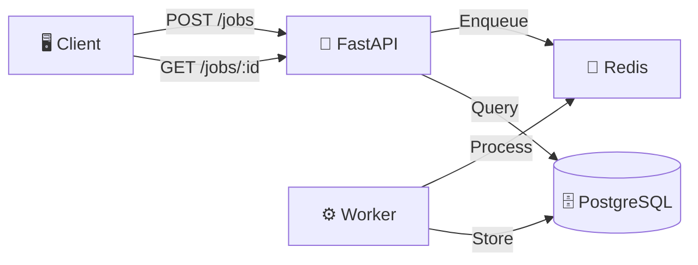

# 🚀 Showcase Projects

> A curated collection of production-ready demo projects demonstrating modern software engineering practices, observability, and DevOps excellence.

[](https://opensource.org/licenses/MIT)
[](http://makeapullrequest.com)

---

## 📋 Overview

This repository showcases industry-standard implementations across multiple domains:

- **Backend Architecture** - Modular JVM builds, Spring Boot, FastAPI
- **Observability** - OpenTelemetry instrumentation, metrics, and traces
- **Distributed Systems** - Event-driven workflows, queue-based processing
- **Testing & Quality** - Comprehensive test strategies and automation
- **SRE Practices** - Audit templates, runbooks, and operational excellence

Each project is self-contained, production-ready, and thoroughly documented.

---

## 🎯 Projects

### 1. 🏗️ [Modular JVM Build](./modular-jvm-build)

**Clean multi-module Gradle architecture with Spring Boot**

```
📦 modular-jvm-build
 ├─ core    → Shared domain logic
 ├─ api     → REST API layer
 └─ app     → Spring Boot application
```

**Key Features:**
- ✅ Multi-module Gradle setup with Kotlin DSL
- ✅ Cross-platform support (Apple Silicon & x86)
- ✅ Spring Boot REST API
- ✅ Clean separation of concerns

**Tech Stack:** `Kotlin` • `Java` • `Gradle` • `Spring Boot`

[→ View Project](./modular-jvm-build)

---

### 2. 📊 [OTel Demo Stack](./otel-demo-stack)

**End-to-end observability with OpenTelemetry**

```
🔄 API → 📡 Collector → 📈 Backend
         ↑
🔧 Worker
```

**Key Features:**
- ✅ Instrumented FastAPI service
- ✅ Background worker with span propagation
- ✅ OpenTelemetry Collector integration
- ✅ W3C Trace Context propagation
- ✅ SRE verification guide included

**Tech Stack:** `Python` • `FastAPI` • `OpenTelemetry` • `Docker`

[→ View Project](./otel-demo-stack)

---

### 3. 📝 [Platform Audit Template](./platform-audit-template)

**Reusable SRE audit framework and operational documentation**

**Key Features:**
- ✅ Service maturity assessment framework
- ✅ Production runbooks (OTel verification, billing diagnostics)
- ✅ SRE communications checklist
- ✅ Telemetry-driven rollout playbook
- ✅ Diagnostic script patterns

**Use Cases:** Service audits • Incident response • Rollout planning • Team onboarding

[→ View Project](./platform-audit-template)

---

### 4. 🔌 [REST API Test Demo](./rest-api-test-demo)

**Production-grade REST API with comprehensive testing**

**Key Features:**
- ✅ FastAPI with OpenAPI/Swagger documentation
- ✅ Unit & integration test suite (pytest)
- ✅ Docker containerization
- ✅ CI/CD ready with GitHub Actions
- ✅ Test coverage reporting

**Tech Stack:** `Python` • `FastAPI` • `Pytest` • `Docker`

[→ View Project](./rest-api-test-demo)

---

### 5. ⚙️ [Workflow API Demo](./workflow-api-demo)

**Event-driven distributed pipeline with API and worker**



**Key Features:**
- ✅ Job queue with Redis
- ✅ Background worker processing
- ✅ PostgreSQL for job persistence
- ✅ RESTful API for job management
- ✅ Full Docker Compose stack

**Tech Stack:** `Python` • `FastAPI` • `Redis` • `PostgreSQL` • `Docker`

[→ View Project](./workflow-api-demo)

---

## 🚀 Quick Start

Each project is self-contained with its own README. To get started:

1. **Choose a project** from the list above
2. **Navigate to the directory**: `cd <project-name>`
3. **Follow the README** for setup and running instructions

Most projects use Docker Compose for easy local development:

```bash
docker compose up --build
```

---

## 🛠️ Technology Stack

<table>
<tr>
<td valign="top" width="33%">

### Backend
- Kotlin / Java
- Python
- Spring Boot
- FastAPI

</td>
<td valign="top" width="33%">

### Infrastructure
- Docker / Compose
- Gradle
- OpenTelemetry
- Redis

</td>
<td valign="top" width="33%">

### Practices
- Testing (JUnit, Pytest)
- CI/CD (GitHub Actions)
- Observability
- SRE Documentation

</td>
</tr>
</table>

---

## 📚 Documentation

Each project includes comprehensive documentation:

- **README** - Overview, setup, and quick start
- **Architecture docs** - Design decisions and patterns
- **Test plans** - Testing strategy and approach
- **Runbooks** - Operational procedures (where applicable)

---

## 🤝 Contributing

Contributions, issues, and feature requests are welcome!

1. Fork the repository
2. Create your feature branch (`git checkout -b feature/amazing-feature`)
3. Commit your changes (`git commit -m 'Add amazing feature'`)
4. Push to the branch (`git push origin feature/amazing-feature`)
5. Open a Pull Request

---

## 📄 License

This project is licensed under the MIT License - see individual project directories for details.

---

## 🌟 Highlights

These projects demonstrate:

- ✨ **Production-ready code** - Not just demos, but production-quality implementations
- 🏗️ **Modern architecture** - Modular, scalable, and maintainable designs
- 📊 **Observability first** - Built-in monitoring and tracing
- 🧪 **Test-driven** - Comprehensive test coverage
- 📖 **Well-documented** - Clear README files, runbooks, and guides
- 🐳 **Container-ready** - Docker and Docker Compose support
- 🔄 **CI/CD ready** - GitHub Actions workflows included

---

<p align="center">
  <strong>Built with ❤️ to showcase modern software engineering practices</strong>
</p>

<p align="center">
  <a href="#-projects">Projects</a> •
  <a href="#-quick-start">Quick Start</a> •
  <a href="#-documentation">Documentation</a> •
  <a href="#-contributing">Contributing</a>
</p>
