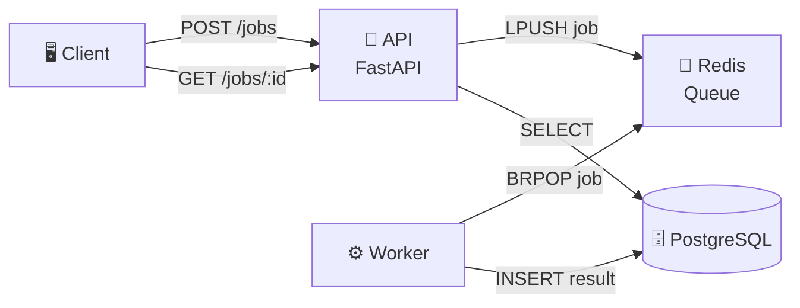

# ⚙️ Workflow API Demo

[](https://www.python.org/)
[](https://fastapi.tiangolo.com/)
[](https://redis.io/)
[](https://www.postgresql.org/)

> Event-driven distributed pipeline demonstrating API-based job submission, queue-based processing, and persistent storage.

## 🎯 Overview

**Problem:** Show a small distributed pipeline: an API that enqueues work, a worker that processes it, and a datastore for results.

**Solution:** An HTTP API (FastAPI) that submits jobs to a Redis queue; a Python worker consumes the queue, processes each job, and records results in PostgreSQL. Docker Compose runs the full stack.

**What this demonstrates:** Designing and implementing a small event-driven pipeline with clear API design and documentation—aligned with GraphQL/Kafka-style workflows and streamlined pipelines.

---

## 🏗️ Architecture



### Components

- **🔌 API:** Accepts `POST /jobs` (enqueue) and `GET /jobs/{id}` (status/result). Uses Redis to push job IDs to a list; worker pops and processes.
- **⚙️ Worker:** Blocks on Redis (BRPOP), loads job payload, "processes" (e.g. sleep + update status), writes result to PostgreSQL.
- **🗄️ PostgreSQL:** Stores job id, status, result, created_at.

---

## 🚀 How to Run Locally

### Using Docker Compose (Recommended)

```bash
docker compose up --build
```

### Endpoints

- 🌐 **API:** http://localhost:8000  
- 📚 **Docs:** http://localhost:8000/docs  

### Example Usage

```bash
# Create a job
curl -X POST http://localhost:8000/jobs \
  -H "Content-Type: application/json" \
  -d '{"payload": "hello"}'
# Returns: {"id": "uuid", "status": "queued"}

# Get job status/result
curl http://localhost:8000/jobs/{id}
```

---

## 🚀 Production Rollout Strategy

For production, you would:

1. **Deploy** new worker version behind a feature flag or canary pool
2. **Route** a small percentage of traffic to the new worker
3. **Monitor** error rate and latency metrics
4. **Rollback** if thresholds are exceeded

📖 A comprehensive **telemetry-driven rollout playbook** (pre-release, canary, staged) is provided in the sibling repo: [platform-audit-template/docs/rollout-playbook.md](../platform-audit-template/docs/rollout-playbook.md)

---

## 📄 License

MIT License - see the LICENSE file for details.

---

[← Back to Showcase Projects](../README.md)
